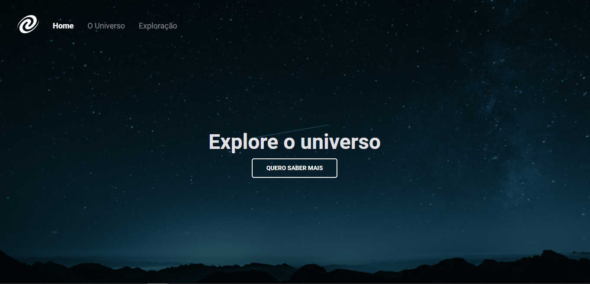
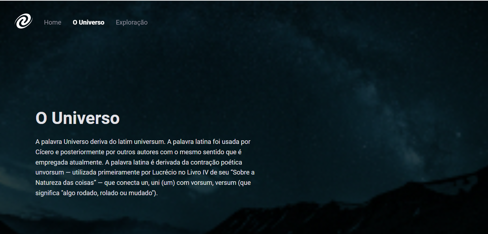
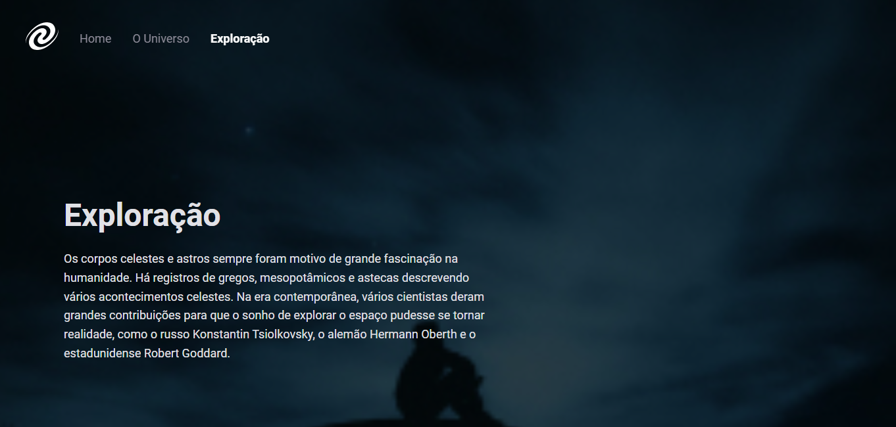
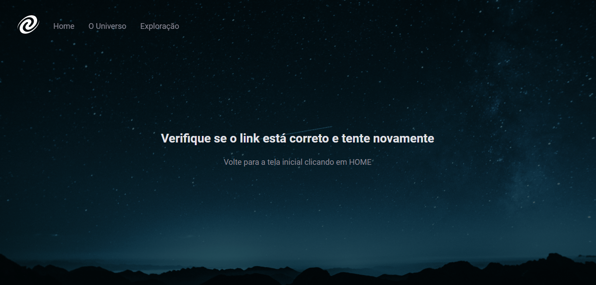

<h1 align="center"> SPA Universe </h1>

  <a href="#-tecnologias">Tecnologias</a>&nbsp;&nbsp;&nbsp;|&nbsp;&nbsp;&nbsp;
  <a href="#-projeto">Projeto</a>&nbsp;&nbsp;&nbsp;|&nbsp;&nbsp;&nbsp;
  <a href="#-layout">Layout</a>&nbsp;&nbsp;&nbsp;|&nbsp;&nbsp;&nbsp;
  <a href="#memo-licença">Licença</a>

  

Nesse projeto aprendi o conceito de SPA (Single-Page Application) e fiz na prática uma aplicação.

 

## 🚀 Tecnologias

Esse projeto foi desenvolvido com as seguintes tecnologias:

&nbsp;
&nbsp;
&nbsp;

## 💻 Projeto

- ES Modules;
- Conceitos de Clean Code
- Mapeamento de rotas;
- Assíncrono e promises;
- Orientação a objetos;
- Manipulação da DOM;
- Web APIs;
- Refatoração;
- Classes e muito mais;

## 🔖 Layout

---
